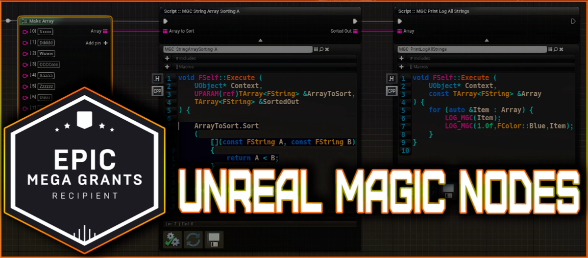
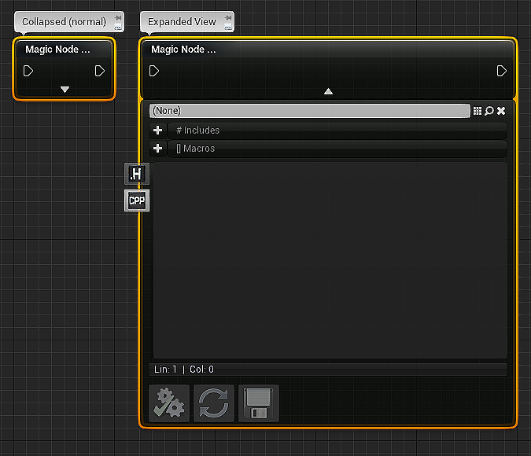
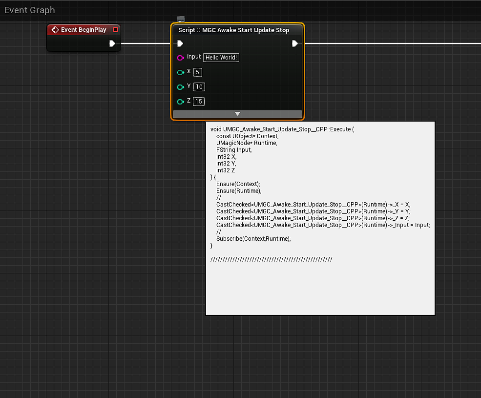
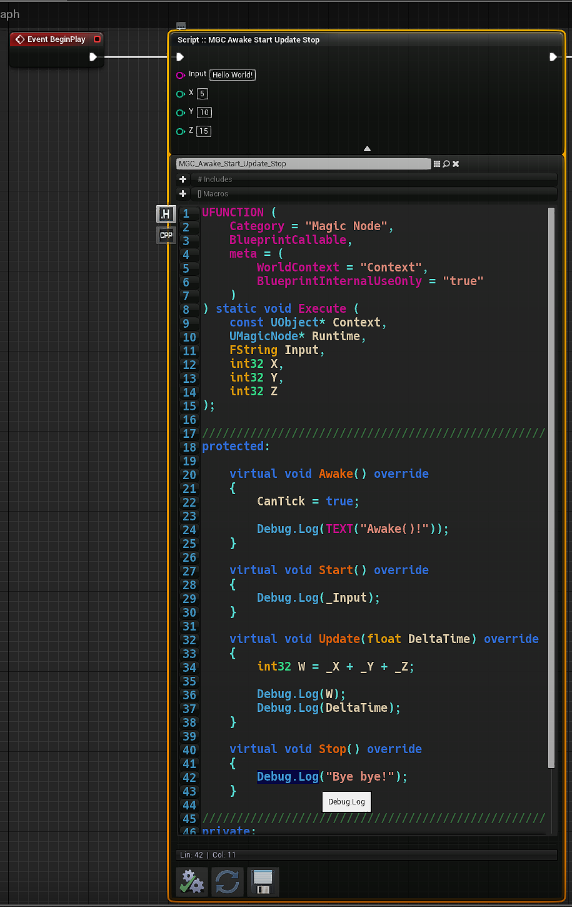
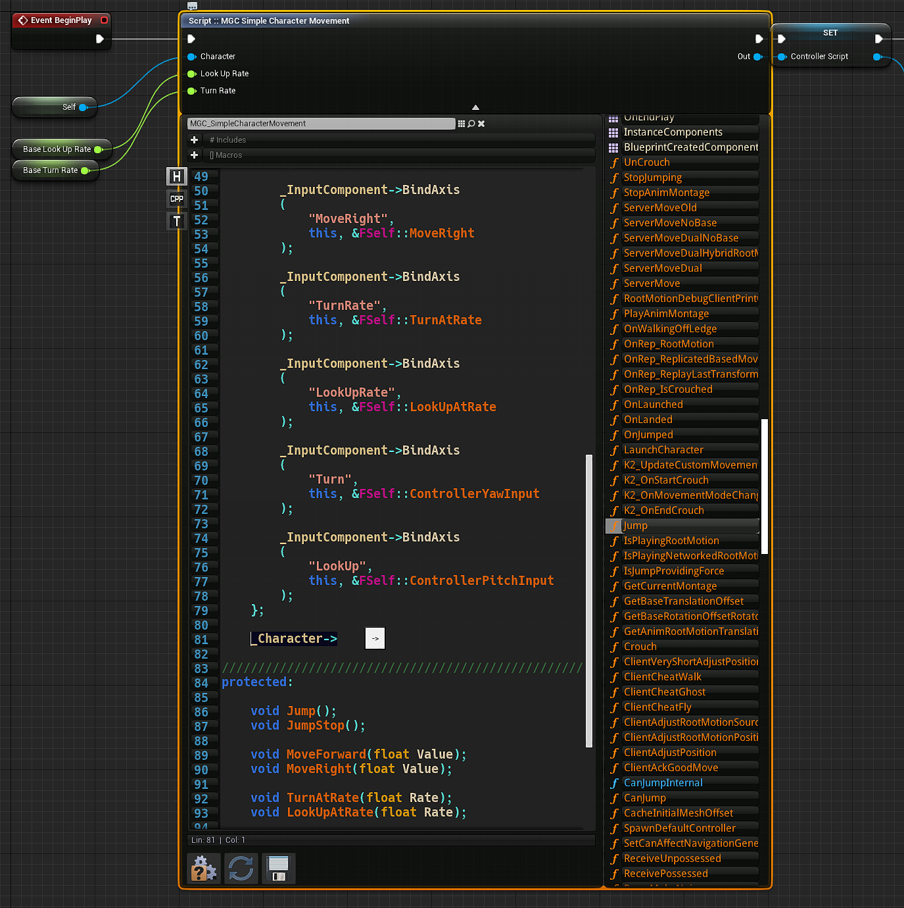
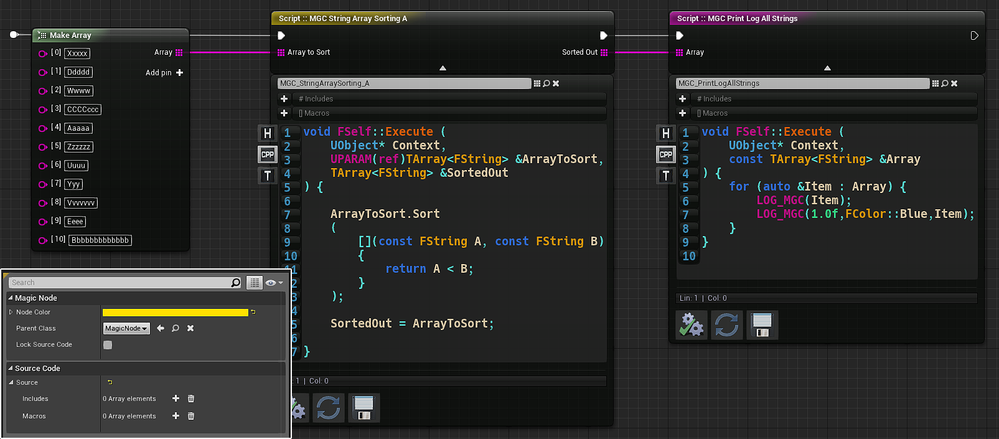

<p align="center">
	
</p>

---

# MAGIC NODE SYSTEM -- UNREAL ENGINE 4 -- CASE STUDY

> (C) BRUNO XAVIER LEITE 2021 - [www.brunoxavierleite.com](https://brunoxavierleite.com/)

----------

## Introduction
When [Epic Games](https://www.epicgames.com/site/en-US/about) intoduced [Blueprints](https://docs.unrealengine.com/4.27/en-US/ProgrammingAndScripting/Blueprints/GettingStarted/) to the world of Interactive Software Development, in the [Unreal Engine 4](https://www.unrealengine.com/en-US/) toolset circa May 2014, that was a game changing moment for the Game Development Community.<br>
Just like when the new technology embedded into the new [Unreal Engine 5](https://www.unrealengine.com/en-US/unreal-engine-5) was announced, with once again the bleeding edge of modern Computer Generated Graphics, back then I was just as excited.<br>
Blueprints system immediately inspired tools developers to build their own versions of visual scripting on competing game engine packages. The core selling points were clear: faster prototyping, less coding, less effort to build more content, focus on content and free programmers to work on lower level systems. However with years passing by, and us developers accumulating experience along these years, occasional hints started to surface that [productivity and prototyping could improve](https://www.youtube.com/watch?v=j6mskTgL7kU) as well as the [implications of basing an entire project on Blueprints](https://www.youtube.com/watch?v=0YMS2wnykbc) could bring to the table.

While the [list of products released](https://en.wikipedia.org/wiki/List_of_Unreal_Engine_games) that successfully made use of Unreal Engine 4 and its plethora of tools increased, the now experienced Unreal Developer Community, understood that the Blueprints system often introduced pain points both in prototyping and actual development phases. Often, the common problems were related to performance bottlenecks caused by misuse of the Blueprint Virtual Machine, previously known as [Kismet](https://docs.unrealengine.com/udk/Three/KismetHome.html).<br>

With consensus, the Unreal Developer Community agreed that, a strategic mixture of Blueprints and Native Code is a healthy practice for complex project development and a key ingredient to extract every bit of performance combined with productivity that the Unreal Engine 4 can offer. That being the case, many studios started to implement a variety of practices, usually involving hiring somebody knowledgeable enough in the Unreal API to convert Blueprint Graphs to C++, native code.<br>
I myself had to wear this hat for many times, converting Blueprints to C++. So, while many of us were doing this work process of mixing Blueprints with C++ code, a few more started to notice new pain points surfacing:

+ Visual Studio Freezes.
+ Productivity Slowdown.
+ Unreliable Hot Reloading.
+ Documenting what are Blueprints and was converted.
+ Time spent documenting what should be nativized next.
+ Constantly rerouting native function calls that were refactored.

To name a few.<br>
So, recognizing that workflow can be improved, eventually Epic Games introduced an automated [Blueprint Nativizer](https://docs.unrealengine.com/4.27/en-US/ProgrammingAndScripting/Blueprints/TechnicalGuide/NativizingBlueprints/) mechanism.<br>
And that is a great accomplishment... that unfortunately brings in its own pain points to the team and won't be mainted in the Unreal Engine 5 toolset.

In the meantime, the community in the *What-IF* land discussed here and there:<br>
> "-What IF we could just skip all that and, maybe, write code on a function node itself?<br>
> "-Would that be possible? Even if just for function prototyping?

That would be a great add-on to our prototyping speed, scripting a node in-place before deciding to implement the final C++ class, we would avoid many of the pain points specially the **rerouting of deleted Kismet Functions**.<br>
But, unfortunally, there was not anything similar to that in the Unreal Engine toolset, it was not possible.<br>
However I was conviced that there must be a way to achieve that goal, and so there started the research...

---


---

## Initial Research
For some time, I first had to do a patient analysis of the [Blueprint Virtual Machine](https://en.wikipedia.org/wiki/Virtual_machine), to understand what I was dealing with in reality. It's not a simple topic.<br>
Internally Unreal uses a markup language to construct visual graphs while compiling user instructions to [bytecode](https://pt.wikipedia.org/wiki/Bytecode).<br>
Luckly [I already had some experience](https://www.unrealengine.com/marketplace/en-US/profile/Bruno+Xavier+L) building Custom Nodes with [Unreal's Plugin System](https://docs.unrealengine.com/4.27/en-US/ProductionPipelines/Plugins/).

### Primary Prototype Goals:
 * Creating In-Node Scripting Editor.
 * Making Use of Existing Kismet Compiler.
 * Scripting and running a "Hello World" function.
 * No Engine Modifications, Self-Contained Plugins.

Since engine modifications introduce another whole separate set of pain points to teams working on a given project, I have imposed on myself that this should be worked as a self-contained plugin.<br>
And so, working on this system naturaly required understanding of the [Unreal Build System](https://docs.unrealengine.com/4.27/en-US/ProductionPipelines/UnrealBuildSystem/).

---

### The Runtime Module

---

```cpp
public class MagicNodeRuntime : ModuleRules
```

This module is responsible for the implementation of the native types that will ship within the final product developed with the Unreal Engine toolset.<br>
The <code>UMagicNode</code> class is the container produced to be the bytecode generated by the Kismet Compiler.
It is meant to be nothing more than a base virtual object class with native methods that can be overriden:

```cpp
void UMagicNode::Run()
{
	if (World==nullptr||HasAnyFlags(RF_ArchetypeObject|RF_ClassDefaultObject)) {return;}

	TickRate = World->GetDeltaSeconds();

	Awake();

	if (CanTick)
	{
		const FTimerDelegate TimerDelegate = FTimerDelegate::CreateUObject(this,&UMagicNode::Tick);
		World->GetTimerManager().SetTimer(UpdateHandler,TimerDelegate,TickRate,true);
	}

	Start();
}
```

Additionally, the <code>UMagicNodeScript</code> class that partially exists in editor-only is implemented right after:

```cpp
UCLASS(classGroup="Synaptech", Category="MagicNode", Blueprintable, hideCategories=("Activation","Variable"), meta=(DisplayName="Magic Node Script"))
class MAGICNODERUNTIME_API UMagicNodeScript : public UObject
{
	GENERATED_BODY()

	UMagicNodeScript();

protected:
	UPROPERTY()
	TSubclassOf<UMagicNode>RuntimeScriptClass;

public:

#if WITH_EDITORONLY_DATA
	UPROPERTY(Category="MagicNode", EditDefaultsOnly)
	FLinearColor NodeColor;

	UPROPERTY(Category="MagicNode", EditDefaultsOnly)
	TSubclassOf<UMagicNode>ParentClass;

	UPROPERTY(Category="MagicNode", EditDefaultsOnly)
	bool LockSourceCode;

	UPROPERTY(Category="Source Code", EditDefaultsOnly)
	FMGC_SourceCode Source;
#endif

	void PostInitProperties() override;

	const bool RefreshRuntimeScriptClass();

	UClass* GetRuntimeScriptClass() const {return RuntimeScriptClass;}
};
```

The <code>#if WITH_EDITORONLY_DATA</code> definition guarantees that type reflection data for those properties will not be carried over to the final packaged product.<br>
This class is specially usefull later, where we must make hooks to the Kismet Compiler, to produce our bytecode.

And the <code>MGC_Allocate</code> template function is the entry point we use to instantiate asynchronous nodes:

```cpp
template<typename T>
static T* MGC_Allocate(UObject* Context, UClass* Class)
{
	if (Context && Context->GetWorld())
	{
		UMagicNode* NewMGC = NewObject<UMagicNode>(Context,Class,NAME_None,RF_Standalone);
		NewMGC->RegisterWorld(Context->GetWorld());
		return CastChecked<T>(NewMGC);
	} return nullptr;
}
```

This is the Core of the runtime module. Very simple, so far so good.

---

### The Kismet Module

---

```cpp
public class MagicNodeKismet : ModuleRules
```

This module is where the fun begins. The first problems are:
> How are we going to compile an isolated node that can be replaced at will without rebuilding the entire Controller or Character classes that might be hosting that node and everything that is compiled into the **UnrealEditor-Project.dll** ?<br>
And more importantly, how can we abuse Unreal's [Adaptive Build System](https://docs.unrealengine.com/4.26/en-US/ProductionPipelines/BuildTools/UnrealBuildTool/BuildConfiguration/) to achieve this?

Custom scripting parsing to generate new Native C++ classes with the <code>IKMGC_ScriptParser</code> class.<br>
We first produce a <code>EMGC_CompilerResult CompileScriptClass(...)</code> that can handle this dilemma for us and handle a call to it from the Kismet Compiler, so for that we must then setup a Custom Kismet Node class (K2Node):

```cpp
UCLASS()
class MAGICNODEKISMET_API UKMGC_MagicNode : public UK2Node, public IKMGC_ScriptParser
{
	GENERATED_UCLASS_BODY()

private:
	bool CollapsePanel;

protected:
	TWeakObjectPtr<UMagicNode>RuntimeScriptObject = nullptr;

	TSharedPtr<SKMGC_MagicNodeWidget>ScriptNodeWidget;
	EMGC_CompilerResult CompilerResult;
	FNodeTextCache CachedNodeTitle;
	FText NodeTooltip;

	void ScriptPinChanged();

protected:
	void CompileProject();

public:
	virtual void ExpandNode(FKismetCompilerContext &CompilerContext, UEdGraph* SourceGraph) override;
	virtual UFunction* ExpandScript(const UMagicNodeScript* Script);


	virtual void PostPlacedNewNode() override;
	virtual void PostReconstructNode() override;
	virtual void AllocateDefaultPins() override;
	virtual void PinDefaultValueChanged(UEdGraphPin* Pin) override;
	virtual void PinConnectionListChanged(UEdGraphPin* Pin) override;
	virtual void ReallocatePinsDuringReconstruction(TArray<UEdGraphPin*>&OldPins) override;
	virtual void GetMenuActions(FBlueprintActionDatabaseRegistrar &ActionRegistrar) const override;

	virtual bool IsNodeSafeToIgnore() const override {return false;}
	virtual bool ShowPaletteIconOnNode() const override {return true;}
	virtual bool ShouldShowNodeProperties() const override {return true;}
	virtual bool NodeCausesStructuralBlueprintChange() const override {return true;}

	virtual bool IsCompatibleWithGraph(const UEdGraph* TargetGraph) const override;
	virtual class FNodeHandlingFunctor* CreateNodeHandler(FKismetCompilerContext &CompilerContext) const override;

	virtual FName GetCornerIcon() const override;
	virtual FText GetTooltipText() const override;
	virtual FText GetMenuCategory() const override;
	virtual FLinearColor GetNodeTitleColor() const override;
	virtual FText GetNodeTitle(ENodeTitleType::Type TType) const override;
	virtual FSlateIcon GetIconAndTint(FLinearColor &OutColor) const override;

	virtual TSharedPtr<SGraphNode>CreateVisualWidget() override;


	bool HasScript() const;
	bool CanCompileProject() const;
	bool IsDefaultPin(UEdGraphPin* Pin);
	bool IsDefaultParam(const TFieldPath<FProperty>Param);
	void CreatePinsForScript(UFunction* Function=nullptr);

	UEdGraphPin* GetExecPin() const;
	UEdGraphPin* GetThenPin() const;
	UEdGraphPin* GetScriptPin(const TArray<UEdGraphPin*>*InPinsToSearch=nullptr) const;
	UEdGraphPin* GetContextPin(const TArray<UEdGraphPin*>*InPinsToSearch=nullptr) const;


	FString GetTypesText() const;
	FString GetScriptText() const;
	FString GetHeaderText() const;
	FString GetParentClass() const;

	TArray<FString>GetMacros() const;
	TArray<FString>GetIncludes() const;

	UMagicNode* GetRuntimeScriptObject();
	UMagicNodeScript* GetScriptObject() const;

	void SetTooltip(const FString &New);
	void SetScriptObject(UMagicNodeScript* New);

	void CompileScript();
	void ReloadRuntimeScript();


	void UpdateDatabaseReferences();
};
```

The critical runtime methods here will be:

* <code>UFunction* ExpandScript(const UMagicNodeScript* Script)</code>
* <code>void CreatePinsForScript(UFunction* Function=nullptr)</code>
* <code>UMagicNodeScript* GetScriptObject() const</code>
* <code>UMagicNodeScript* GetScriptObject() const</code>
* <code>void ReloadRuntimeScript()</code>
* <code>void CompileScript()</code>

```cpp
UFunction* UKMGC_MagicNode::ExpandScript(const UMagicNodeScript* Script)
{
	if (Script==nullptr) {return nullptr;}

	UMagicNode* RuntimeScript = GetRuntimeScriptObject();

	if (RuntimeScript==nullptr) {return nullptr;}

	return RuntimeScript->FindFunction(UKMGC_MagicNodeHelper::EXE);
}
```

Then we have the entry point for actual visual customizations of the node, only relevant to the Unreal Editor:

* <code>virtual TSharedPtr<SGraphNode>CreateVisualWidget() override</code>

```cpp
TSharedPtr<SGraphNode>UKMGC_MagicNode::CreateVisualWidget()
{
	return SAssignNew(ScriptNodeWidget,SKMGC_MagicNodeWidget,this);
}
```
As you can notice, we are required to provide our own [Unreal Slate UI](https://docs.unrealengine.com/4.26/en-US/ProgrammingAndScripting/Slate/Architecture/)'s widget class from here.<br>
So we must implement the <code>SKMGC_MagicNodeWidget</code> widget type before going any further:

```cpp
class SKMGC_MagicNodeWidget : public SGraphNode
{
public:
	SKMGC_MagicNodeWidget();
	virtual ~SKMGC_MagicNodeWidget() override;

	SLATE_BEGIN_ARGS(SKMGC_MagicNodeWidget)
	{}
	SLATE_END_ARGS()

	//...

	void Construct(const FArguments &InArgs, UKMGC_MagicNode* InGraphNode);
};
```
The critical runtime method in this class will be:

* <code>void CreateBelowWidgetControls(TSharedPtr<SVerticalBox>MainBox) override</code>

After reasonable effort writing UI code, we should now pleasantly be able to witness the custom node on Blueprint Graphs:

```cpp
void SKMGC_MagicNodeWidget::CreateBelowWidgetControls(TSharedPtr<SVerticalBox>MainBox)
{
	UpdateDatabaseReferences();

	AutoComplete = EAutoComplete::Off;
	Source = ESKMGC_Source::Header;
	ViewSearchBox = false;

	SetLineCountList(GetLineCount());
	SetMacrosList(GetScriptMacros());
	SetIncludesList(GetScriptIncludes());


	VS_SCROLL = SNew(SScrollBar)
	.OnUserScrolled(this,&SKMGC_MagicNodeWidget::OnInternalVerticalScroll)
	.Thickness(FVector2D(8.f,8.f)).AlwaysShowScrollbar(false)
	.Orientation(Orient_Vertical);

	HSS_SCROLL = SNew(SScrollBar)
	.OnUserScrolled(this,&SKMGC_MagicNodeWidget::OnScriptHorizontalScroll)
	.Visibility(this,&SKMGC_MagicNodeWidget::GetScriptPanelVisibility)
	.Orientation(Orient_Horizontal).AlwaysShowScrollbar(false)
	.Thickness(FVector2D(8.f,8.f));

	HSH_SCROLL = SNew(SScrollBar)
	.OnUserScrolled(this,&SKMGC_MagicNodeWidget::OnHeaderHorizontalScroll)
	.Visibility(this,&SKMGC_MagicNodeWidget::GetHeaderPanelVisibility)
	.Orientation(Orient_Horizontal).AlwaysShowScrollbar(false)
	.Thickness(FVector2D(8.f,8.f));

	AUTOCOMPLETE_SCROLL = SNew(SScrollBar)
	.OnUserScrolled(this,&SKMGC_MagicNodeWidget::OnInternalAutoCompleteScroll)
	.Thickness(FVector2D(8.f,8.f)).AlwaysShowScrollbar(false)
	.Orientation(Orient_Vertical);


	MainBox->AddSlot()
	.VAlign(VAlign_Top).HAlign(HAlign_Fill)
	[
		SNew(SHorizontalBox)
		+SHorizontalBox::Slot()
		.VAlign(VAlign_Fill).HAlign(HAlign_Fill)
		[
			SNew(SBorder).Padding(1)
			.Visibility(this,&SKMGC_MagicNodeWidget::GetScriptEditorVisibility)
			.BorderImage(FEditorStyle::GetBrush("Graph.Node.Body"))
			.ColorAndOpacity(FLinearColor(1.f,1.f,1.f,0.8f))
			[
				SNew(SVerticalBox)
				+SVerticalBox::Slot()
				.AutoHeight().Padding(10,5,10,5)
				[
					SNew(SHorizontalBox)
					+SHorizontalBox::Slot().HAlign(HAlign_Fill)
					[
						SAssignNew(SCRIPT_PICKER,SContentReference)
						.AssetReference(this,&SKMGC_MagicNodeWidget::GetScriptObject)
						.OnSetReference(this,&SKMGC_MagicNodeWidget::SetScriptObject)
						.AssetPickerSizeOverride(FVector2D(540.f,360.f))
						.AllowedClass(UMagicNodeScript::StaticClass())
						.ShowFindInBrowserButton(true)
						.AllowClearingReference(true)
						.AllowSelectingNewAsset(true)
						.ShowToolsButton(false)
						.WidthOverride(400.f)
					]
				]
				+SVerticalBox::Slot()
				.AutoHeight().Padding(10,0,10,0)
				[
					SNew(SVerticalBox)
					+SVerticalBox::Slot().AutoHeight()
					[
						SNew(SHorizontalBox)
						+SHorizontalBox::Slot().AutoWidth()
						.VAlign(VAlign_Center).HAlign(HAlign_Left)
						[
							SNew(SBorder)
							.VAlign(VAlign_Fill).HAlign(HAlign_Fill)
							.BorderImage(FEditorStyle::GetBrush("Graph.Node.Body"))
							[
								SNew(SButton)
								.OnClicked(this,&SKMGC_MagicNodeWidget::OnClickedAddInclude)
								.ButtonStyle(FEditorStyle::Get(),"NoBorder")
								.VAlign(VAlign_Center).HAlign(HAlign_Center)
								[
									SNew(SImage)
									.Image(FEditorStyle::GetBrush("Plus"))
								]
							]
						]
						+SHorizontalBox::Slot()
						.VAlign(VAlign_Center).HAlign(HAlign_Fill)
						[
							SNew(SBorder)
							.VAlign(VAlign_Fill).HAlign(HAlign_Fill)
							.BorderImage(FEditorStyle::GetBrush("Graph.Node.Body"))
							[
								SNew(SButton)
								.OnClicked(this,&SKMGC_MagicNodeWidget::OnClickedViewIncludes)
								.ButtonStyle(FEditorStyle::Get(),"NoBorder")
								.VAlign(VAlign_Fill).HAlign(HAlign_Fill)
								[
									SNew(STextBlock).Margin(FMargin(5,0,0,0))
									.Text(LOCTEXT("KMGC_IncludesPanel","# Includes"))
									.ColorAndOpacity(FSlateColor(FLinearColor(FColor(155,155,155,225))))
								]
							]
						]
					]
					+SVerticalBox::Slot().AutoHeight()
					[
						SNew(SBorder)
						.VAlign(VAlign_Fill).HAlign(HAlign_Fill)
						.BorderImage(FEditorStyle::GetBrush("Graph.Node.Body"))
						.Visibility(this,&SKMGC_MagicNodeWidget::GetIncludesPanelVisibility)
						[
							SAssignNew(INCLUDES_LIST,SListView<TSharedPtr<FString>>)
							.OnGenerateRow(this,&SKMGC_MagicNodeWidget::OnGenerateIncludes)
							.ScrollbarVisibility(EVisibility::Hidden)
							.SelectionMode(ESelectionMode::Single)
							.ListItemsSource(&SourceIncludes)
						]
					]
					+SVerticalBox::Slot().AutoHeight()
					[
						SNew(SHorizontalBox)
						+SHorizontalBox::Slot().AutoWidth()
						.VAlign(VAlign_Center).HAlign(HAlign_Left)
						[
							SNew(SBorder)
							.VAlign(VAlign_Fill).HAlign(HAlign_Fill)
							.BorderImage(FEditorStyle::GetBrush("Graph.Node.Body"))
							[
								SNew(SButton)
								.OnClicked(this,&SKMGC_MagicNodeWidget::OnClickedAddMacro)
								.ButtonStyle(FEditorStyle::Get(),"NoBorder")
								.VAlign(VAlign_Center).HAlign(HAlign_Center)
								[
									SNew(SImage)
									.Image(FEditorStyle::GetBrush("Plus"))
								]
							]
						]
						+SHorizontalBox::Slot()
						.VAlign(VAlign_Center).HAlign(HAlign_Fill)
						[
							SNew(SBorder)
							.VAlign(VAlign_Fill).HAlign(HAlign_Fill)
							.BorderImage(FEditorStyle::GetBrush("Graph.Node.Body"))
							[
								SNew(SButton)
								.OnClicked(this,&SKMGC_MagicNodeWidget::OnClickedViewMacros)
								.ButtonStyle(FEditorStyle::Get(),"NoBorder")
								.VAlign(VAlign_Fill).HAlign(HAlign_Fill)
								[
									SNew(STextBlock).Margin(FMargin(5,0,0,0))
									.Text(LOCTEXT("KMGC_MacrosPanel","[] Macros"))
									.ColorAndOpacity(FSlateColor(FLinearColor(FColor(155,155,155,225))))
								]
							]
						]
					]
					+SVerticalBox::Slot().AutoHeight()
					[
						SNew(SBorder)
						.VAlign(VAlign_Fill).HAlign(HAlign_Fill)
						.BorderImage(FEditorStyle::GetBrush("Graph.Node.Body"))
						.Visibility(this,&SKMGC_MagicNodeWidget::GetMacrosPanelVisibility)
						[
							SAssignNew(MACROS_LIST,SListView<TSharedPtr<FString>>)
							.OnGenerateRow(this,&SKMGC_MagicNodeWidget::OnGenerateMacros)
							.ScrollbarVisibility(EVisibility::Hidden)
							.SelectionMode(ESelectionMode::Single)
							.ListItemsSource(&SourceMacros)
						]
					]
				]
				+SVerticalBox::Slot()
				.FillHeight(1.f).Padding(10,5,10,5)
				[
					SNew(SHorizontalBox)
					+SHorizontalBox::Slot()
					.HAlign(HAlign_Left).AutoWidth()
					[
						SNew(SVerticalBox)
						+SVerticalBox::Slot()
						.AutoHeight().Padding(-32,0,0,4)
						[
							SNew(SButton)
							.ButtonColorAndOpacity(this,&SKMGC_MagicNodeWidget::GetHeaderIconColor)
							.OnClicked(this,&SKMGC_MagicNodeWidget::OnClickedHeaderIcon)
							.VAlign(VAlign_Top).HAlign(HAlign_Left)
							[
								SNew(SImage)
								.Image(FKMGC_NodeStyle::Get()->GetBrush(TEXT("KMGC.Toolbar.H")))
							]
						]
						+SVerticalBox::Slot()
						.AutoHeight().Padding(-32,0,0,4)
						[
							SNew(SButton)
							.ButtonColorAndOpacity(this,&SKMGC_MagicNodeWidget::GetScriptIconColor)
							.OnClicked(this,&SKMGC_MagicNodeWidget::OnClickedScriptIcon)
							.VAlign(VAlign_Top).HAlign(HAlign_Left)
							[
								SNew(SImage)
								.Image(FKMGC_NodeStyle::Get()->GetBrush(TEXT("KMGC.Toolbar.CPP")))
							]
						]
						+SVerticalBox::Slot()
						.AutoHeight().Padding(-32,0,0,4)
						[
							SNew(SButton)
							.ButtonColorAndOpacity(this,&SKMGC_MagicNodeWidget::GetTypesIconColor)
							.OnClicked(this,&SKMGC_MagicNodeWidget::OnClickedTypesIcon)
							.VAlign(VAlign_Top).HAlign(HAlign_Left)
							[
								SNew(SImage)
								.Image(FKMGC_NodeStyle::Get()->GetBrush(TEXT("KMGC.Toolbar.T")))
							]
						]
					]
					+SHorizontalBox::Slot()
					.VAlign(VAlign_Fill).HAlign(HAlign_Fill)
					[
						SNew(SOverlay)
						+SOverlay::Slot()
						.VAlign(VAlign_Fill).HAlign(HAlign_Fill)
						[
							SNew(SBox)
							.VAlign(VAlign_Fill).HAlign(HAlign_Fill)
							.MinDesiredWidth(400.f).MinDesiredHeight(250.f)
							.MaxDesiredHeight(1500.f).MaxDesiredWidth(1200.f)
							[
								SNew(SBorder)
								.VAlign(VAlign_Fill).HAlign(HAlign_Fill)
								.BorderImage(FEditorStyle::GetBrush("ToolPanel.DarkGroupBorder"))
								[
									SAssignNew(VS_SCROLL_BOX,SScrollBox)
									.OnUserScrolled(this,&SKMGC_MagicNodeWidget::OnVerticalScroll)
									.Orientation(EOrientation::Orient_Vertical)
									.ScrollBarThickness(FVector2D(8.f,8.f))
									+SScrollBox::Slot()
									[
										SNew(SHorizontalBox)
										+SHorizontalBox::Slot()
										.VAlign(VAlign_Fill).HAlign(HAlign_Left).AutoWidth()
										[
											SNew(SBorder)
											.VAlign(VAlign_Fill).HAlign(HAlign_Fill)
											.BorderImage(FEditorStyle::GetBrush("Graph.Node.Body"))
											[
												SAssignNew(LINE_COUNTER,SListView<TSharedPtr<FString>>)
												.OnSelectionChanged(this,&SKMGC_MagicNodeWidget::OnSelectedLineCounterItem)
												.OnGenerateRow(this,&SKMGC_MagicNodeWidget::OnGenerateLineCounter)
												.ScrollbarVisibility(EVisibility::Collapsed)
												.ListItemsSource(&LineCount).ItemHeight(14)
												.SelectionMode(ESelectionMode::Single)
											]
										]
										+SHorizontalBox::Slot()
										.VAlign(VAlign_Fill).HAlign(HAlign_Fill)
										[
											SAssignNew(SCRIPT_EDITOR,SKMGC_TextEditorWidget)
											.OnTextChanged(this,&SKMGC_MagicNodeWidget::OnScriptTextChanged,ETextCommit::Default)
											.OnTextCommitted(this,&SKMGC_MagicNodeWidget::OnScriptTextComitted)
											.Visibility(this,&SKMGC_MagicNodeWidget::GetScriptPanelVisibility)
											.OnInvokeSearch(this,&SKMGC_MagicNodeWidget::OnInvokedSearch)
											.OnAutoComplete(this,&SKMGC_MagicNodeWidget::OnAutoComplete)
											.IsEnabled(this,&SKMGC_MagicNodeWidget::HasScript)
											.Text(this,&SKMGC_MagicNodeWidget::GetScriptText)
											.VScrollBar(VS_SCROLL).HScrollBar(HSS_SCROLL)
											.Marshaller(MARSHALL.ToSharedRef())
											.CanKeyboardFocus(true)
											.IsReadOnly(false)
										]
										+SHorizontalBox::Slot()
										.VAlign(VAlign_Fill).HAlign(HAlign_Fill)
										[
											SAssignNew(HEADER_EDITOR,SKMGC_TextEditorWidget)
											.OnTextChanged(this,&SKMGC_MagicNodeWidget::OnHeaderTextChanged,ETextCommit::Default)
											.OnTextCommitted(this,&SKMGC_MagicNodeWidget::OnHeaderTextComitted)
											.Visibility(this,&SKMGC_MagicNodeWidget::GetHeaderPanelVisibility)
											.OnInvokeSearch(this,&SKMGC_MagicNodeWidget::OnInvokedSearch)
											.OnAutoComplete(this,&SKMGC_MagicNodeWidget::OnAutoComplete)
											.IsEnabled(this,&SKMGC_MagicNodeWidget::HasScript)
											.Text(this,&SKMGC_MagicNodeWidget::GetHeaderText)
											.VScrollBar(VS_SCROLL).HScrollBar(HSH_SCROLL)
											.Marshaller(MARSHALL.ToSharedRef())
											.CanKeyboardFocus(true)
											.IsReadOnly(false)
										]
										+SHorizontalBox::Slot()
										.VAlign(VAlign_Fill).HAlign(HAlign_Fill)
										[
											SAssignNew(TYPES_EDITOR,SKMGC_TextEditorWidget)
											.OnTextChanged(this,&SKMGC_MagicNodeWidget::OnTypesTextChanged,ETextCommit::Default)
											.OnTextCommitted(this,&SKMGC_MagicNodeWidget::OnTypesTextComitted)
											.Visibility(this,&SKMGC_MagicNodeWidget::GetTypesPanelVisibility)
											.OnInvokeSearch(this,&SKMGC_MagicNodeWidget::OnInvokedSearch)
											.OnAutoComplete(this,&SKMGC_MagicNodeWidget::OnAutoComplete)
											.IsEnabled(this,&SKMGC_MagicNodeWidget::HasScript)
											.Text(this,&SKMGC_MagicNodeWidget::GetTypesText)
											.VScrollBar(VS_SCROLL).HScrollBar(HSH_SCROLL)
											.Marshaller(MARSHALL.ToSharedRef())
											.CanKeyboardFocus(true)
											.IsReadOnly(false)
										]
									]
								]
							]
						]
						+SOverlay::Slot()
						.VAlign(VAlign_Top).HAlign(HAlign_Right)
						[
							SNew(SBox)
							.VAlign(VAlign_Fill).HAlign(HAlign_Fill)
							.WidthOverride(250.f).HeightOverride(80.f)
							.Visibility(this,&SKMGC_MagicNodeWidget::GetSearchBoxVisibility)
							[
								SNew(SBorder)
								.VAlign(VAlign_Fill).HAlign(HAlign_Fill)
								.BorderImage(FEditorStyle::GetBrush("Sequencer.Thumbnail.SectionHandle"))
								[
									SNew(SBorder)
									.VAlign(VAlign_Fill).HAlign(HAlign_Fill)
									.BorderImage(FEditorStyle::GetBrush("Menu.Background"))
									[
										SNew(SVerticalBox)
										+SVerticalBox::Slot().Padding(5)
										.VAlign(VAlign_Top).HAlign(HAlign_Fill)
										[
											SNew(SHorizontalBox)
											+SHorizontalBox::Slot()
											.Padding(0,2,5,0).AutoWidth()
											.VAlign(VAlign_Top).HAlign(HAlign_Left)
											[
												SNew(SCheckBox)
												.OnCheckStateChanged(this,&SKMGC_MagicNodeWidget::OnSearchSensitiveChanged)
												.IsChecked(this,&SKMGC_MagicNodeWidget::IsSearchSensitive)
												.Style(FEditorStyle::Get(),"ToggleButtonCheckbox")
												.Content()
												[
													SNew(STextBlock).Margin(2)
													.Text(LOCTEXT("KMGC_SearchToggleCase","Aa"))
													.ColorAndOpacity(FSlateColor(FLinearColor(FColor(255,255,255,225))))
													.Font(FKMGC_NodeStyle::Get().Get()->GetWidgetStyle<FTextBlockStyle>("KMGC.CodeBlockStyle").Font)
												]
											]
											+SHorizontalBox::Slot()
											.VAlign(VAlign_Fill).HAlign(HAlign_Fill)
											[
												SAssignNew(SEARCH_TEXT,SEditableTextBox)
												.OnTextChanged(this,&SKMGC_MagicNodeWidget::OnSearchTextChanged,ETextCommit::Default)
												.OnTextCommitted(this,&SKMGC_MagicNodeWidget::OnSearchTextComitted)
												.Text(this,&SKMGC_MagicNodeWidget::GetSearchText)
												.SelectAllTextWhenFocused(true)
											]
											+SHorizontalBox::Slot()
											.Padding(5,2,0,0).AutoWidth()
											.VAlign(VAlign_Top).HAlign(HAlign_Left)
											[
												SNew(SButton)
												.OnClicked(this,&SKMGC_MagicNodeWidget::OnClickedSearchGlass)
												.ButtonStyle(FEditorStyle::Get(),"NoBorder")
												[
													SNew(SImage)
													.Image(FEditorStyle::Get().GetBrush(TEXT("Symbols.SearchGlass")))
												]
											]
										]
										+SVerticalBox::Slot().Padding(5)
										.VAlign(VAlign_Top).HAlign(HAlign_Fill)
										[
											SNew(SHorizontalBox)
											+SHorizontalBox::Slot()
											.Padding(5,0,5,0).AutoWidth()
											.VAlign(VAlign_Top).HAlign(HAlign_Left)
											[
												SNew(SBox)
												.VAlign(VAlign_Fill).HAlign(HAlign_Fill)
												.WidthOverride(22.f).HeightOverride(22.f)
											]
											+SHorizontalBox::Slot()
											.VAlign(VAlign_Fill).HAlign(HAlign_Fill)
											[
												SNew(SEditableTextBox)
												.SelectAllTextWhenFocused(true)
												.Text(this,&SKMGC_MagicNodeWidget::GetReplaceText)
												.OnTextCommitted(this,&SKMGC_MagicNodeWidget::OnReplaceTextComitted)
											]
											+SHorizontalBox::Slot()
											.Padding(5,0,0,5).AutoWidth()
											.VAlign(VAlign_Top).HAlign(HAlign_Left)
											[
												SNew(SButton)
												.OnClicked(this,&SKMGC_MagicNodeWidget::OnClickedReplaceSearch)
												.ButtonStyle(FEditorStyle::Get(),"NoBorder")
												[
													SNew(STextBlock).Margin(2)
													.Text(FText::FromString(FString(TEXT("\xf061"))))
													.Font(FEditorStyle::Get().GetFontStyle("FontAwesome.11"))
													.ColorAndOpacity(FSlateColor(FLinearColor(FColor(255,255,255,225))))
												]
											]
										]
									]
								]
							]
						]
					]
				]
				+SVerticalBox::Slot()
				.AutoHeight().Padding(10,0,10,0)
				[
					SNew(SVerticalBox)
					+SVerticalBox::Slot().AutoHeight()
					[
						HSS_SCROLL.ToSharedRef()
					]
					+SVerticalBox::Slot().AutoHeight()
					[
						HSH_SCROLL.ToSharedRef()
					]
				]
				+SVerticalBox::Slot()
				.AutoHeight().Padding(10,-5,10,5)
				[
					SNew(SBorder)
					.VAlign(VAlign_Fill).HAlign(HAlign_Fill)
					.BorderImage(FEditorStyle::GetBrush("Menu.Background"))
					[
						SNew(STextBlock).Margin(FMargin(5,0,0,0))
						.Text(this,&SKMGC_MagicNodeWidget::GetCursorLocation)
						.ColorAndOpacity(FSlateColor(FLinearColor(FColor(225,225,255,225))))
					]
				]
				+SVerticalBox::Slot()
				.AutoHeight().Padding(10,5,10,5)
				[
					SNew(SHorizontalBox)
					.IsEnabled(this,&SKMGC_MagicNodeWidget::HasScript)
					+SHorizontalBox::Slot().AutoWidth().Padding(0,0,5,0)
					[
						SNew(SButton)
						.ToolTipText(LOCTEXT("KMGC_Compile","Generates node's native C++ classes to compile (C++ binary target)."))
						.OnClicked(this,&SKMGC_MagicNodeWidget::OnClickedCompile)
						.IsEnabled(this,&SKMGC_MagicNodeWidget::CanCompileScript)
						.ButtonStyle(FEditorStyle::Get(),"FlatButton.DarkGrey")
						.ForegroundColor(FSlateColor::UseForeground())
						.VAlign(VAlign_Center).HAlign(HAlign_Left)
						[
							SNew(SImage)
							.Image(this,&SKMGC_MagicNodeWidget::GetCompilerIcon)
						]
					]
					+SHorizontalBox::Slot().AutoWidth().Padding(0,0,5,0)
					[
						SNew(SButton)
						.ToolTipText(LOCTEXT("KMGC_ReloadScript","Rebuilds this node's pins (if there was a successful C++ compilation)."))
						.OnClicked(this,&SKMGC_MagicNodeWidget::OnClickedReloadScript)
						.IsEnabled(this,&SKMGC_MagicNodeWidget::CanCompileScript)
						.ButtonStyle(FEditorStyle::Get(),"FlatButton.DarkGrey")
						.ForegroundColor(FSlateColor::UseForeground())
						.VAlign(VAlign_Center).HAlign(HAlign_Left)
						[
							SNew(SImage)
							.Image(FKMGC_NodeStyle::Get()->GetBrush(TEXT("KMGC.Toolbar.ReloadScript")))
						]
					]
					+SHorizontalBox::Slot().AutoWidth().Padding(0,0,5,0)
					[
						SNew(SButton)
						.ToolTipText(LOCTEXT("KMGC_SaveScript","Saves this node's source code (NOT compilated)."))
						.OnClicked(this,&SKMGC_MagicNodeWidget::OnClickedSaveScript)
						.IsEnabled(this,&SKMGC_MagicNodeWidget::CanCompileScript)
						.ButtonStyle(FEditorStyle::Get(),"FlatButton.DarkGrey")
						.ForegroundColor(FSlateColor::UseForeground())
						.VAlign(VAlign_Center).HAlign(HAlign_Left)
						[
							SNew(SImage)
							.Image(FKMGC_NodeStyle::Get()->GetBrush(TEXT("KMGC.Toolbar.SaveScript")))
						]
					]
					+SHorizontalBox::Slot().AutoWidth().Padding(0,0,5,0)
					[
						SNew(SButton)
						.ToolTipText(LOCTEXT("KMGC_BuildDatabase","The auto-complete system will search for Unreal Types.\nThe list of types is HUGE and this process may take several minutes to complete!"))
						.OnClicked(this,&SKMGC_MagicNodeWidget::OnClickedBuildDatabase)
						.IsEnabled(this,&SKMGC_MagicNodeWidget::CanBuildDatabase)
						.ButtonStyle(FEditorStyle::Get(),"FlatButton.DarkGrey")
						.ForegroundColor(FSlateColor::UseForeground())
						.VAlign(VAlign_Center).HAlign(HAlign_Left)
						[
							SNew(SImage)
							.Image(FKMGC_NodeStyle::Get()->GetBrush(TEXT("KMGC.Toolbar.Database")))
						]
					]
				]
				+SVerticalBox::Slot()
				.AutoHeight().Padding(10,0,10,5)
				[
					SNew(SBorder)
					.VAlign(VAlign_Fill).HAlign(HAlign_Fill)
					.BorderImage(FEditorStyle::GetBrush("Menu.Background"))
					.Visibility(this,&SKMGC_MagicNodeWidget::GetDatabaseWarningVisibility)
					[
						SNew(SVerticalBox)
						+SVerticalBox::Slot()
						.AutoHeight().Padding(0)
						[
							SNew(STextBlock).Margin(FMargin(5,0,0,0))
							.Text(this,&SKMGC_MagicNodeWidget::GetDatabaseLoadTooltip)
							.ColorAndOpacity(FSlateColor(FLinearColor(1.f,0.45f,0.f)))
						]
						+SVerticalBox::Slot()
						.AutoHeight().Padding(2,0,2,0)
						[
							SNew(SProgressBar)
							.BorderPadding(FVector2D::ZeroVector)
							.Percent(this,&SKMGC_MagicNodeWidget::GetDatabaseLoad)
							.FillColorAndOpacity(FSlateColor(FLinearColor(0.5f,0.5f,1.f)))
						]
					]
				]
			]
		]
		+SHorizontalBox::Slot()
		.HAlign(HAlign_Right).AutoWidth().Padding(FMargin(2.f,0.f,0.f,0.f))
		[
			SNew(SBorder)
			.VAlign(VAlign_Fill).HAlign(HAlign_Fill)
			.BorderImage(FEditorStyle::GetBrush("Graph.Node.Body"))
			[
				SNew(SBox)
				.VAlign(VAlign_Fill).HAlign(HAlign_Fill)
				.MinDesiredWidth(50.f).MinDesiredHeight(250.f)
				.MaxDesiredHeight(1250.f).MaxDesiredWidth(250.f)
				.Visibility(this,&SKMGC_MagicNodeWidget::GetAutoCompleteVisibility)
				[
					SAssignNew(AUTOCOMPLETE_BOX,SScrollBox)
					.OnUserScrolled(this,&SKMGC_MagicNodeWidget::OnAutoCompleteScroll)
					.Orientation(EOrientation::Orient_Vertical)
					.ScrollBarThickness(FVector2D(8.f,8.f))
				
					+SScrollBox::Slot()
					.VAlign(VAlign_Fill).HAlign(HAlign_Fill)
					[
						SAssignNew(AUTOCOMPLETE,SListView<TSharedPtr<FString>>)
						.OnMouseButtonDoubleClick(this,&SKMGC_MagicNodeWidget::OnClickedAutoCompleteItem)
						.OnSelectionChanged(this,&SKMGC_MagicNodeWidget::OnSelectedAutoCompleteItem)
						.OnGenerateRow(this,&SKMGC_MagicNodeWidget::OnGenerateAutoComplete)
						.ExternalScrollbar(AUTOCOMPLETE_SCROLL)
						.SelectionMode(ESelectionMode::Single)
						.ListItemsSource(&AutoCompleteList)
					]
				]
			]
		]
	];


	UpdateTextEditorScriptReference();
}
```

Which visually translates to:



Once the Custom Node is solid, we now need a way to actually pick a *Source Code* from where our <code>IKMGC_ScriptParser</code> class can work.<br>
For that, we need to expose the <code>UMagicNodeScript</code> class to the Unreal Editor, and for that we are going to need a custom asset factory...

---

### The Editor Module

---

```cpp
public class MagicNodeEditor : ModuleRules
```

This module is responsible for all things related to Unreal Editor where Kismet Compiler isn't directly involved. For instance, the <code>UMGC_ScriptFactory</code> is our main goal:

```cpp
UCLASS()
class MAGICNODEEDITOR_API UMGC_ScriptFactory : public UFactory
{
	GENERATED_UCLASS_BODY()

protected:
	virtual bool IsMacroFactory() const { return false; }

public:
	virtual UObject* FactoryCreateNew(
		UClass* Class, UObject* InParent,
		FName Name, EObjectFlags Flags,
		UObject* Context, FFeedbackContext* Warn
	) override;

};
```
With that factory we can now create new assets, packages with instances, of the <code>UMagicNodeScript</code> class and drop them into our custom Kismet Node and start typing actual code in the node...




The <code>CompileScript()</code> method, exposed to the UI, generates the bytecode required to execute the function in the Blueprint Virtual Machine without compromising the source code of the main Blueprint class...





---



---
> (C) BRUNO XAVIER LEITE 2021 - [www.brunoxavierleite.com](https://brunoxavierleite.com/)
---
## Further Publications
> ### [C# Unreal Magic Nodes](https://github.com/BrUnOXaVIeRLeiTE/Unreal-Magic-Nodes-CS)